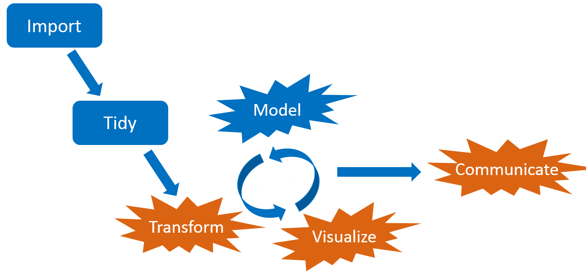
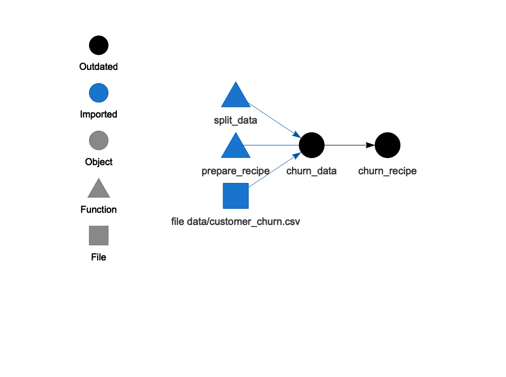
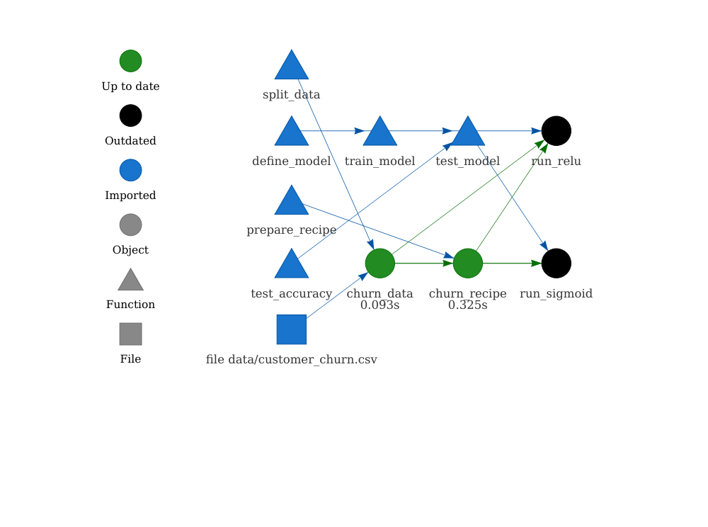
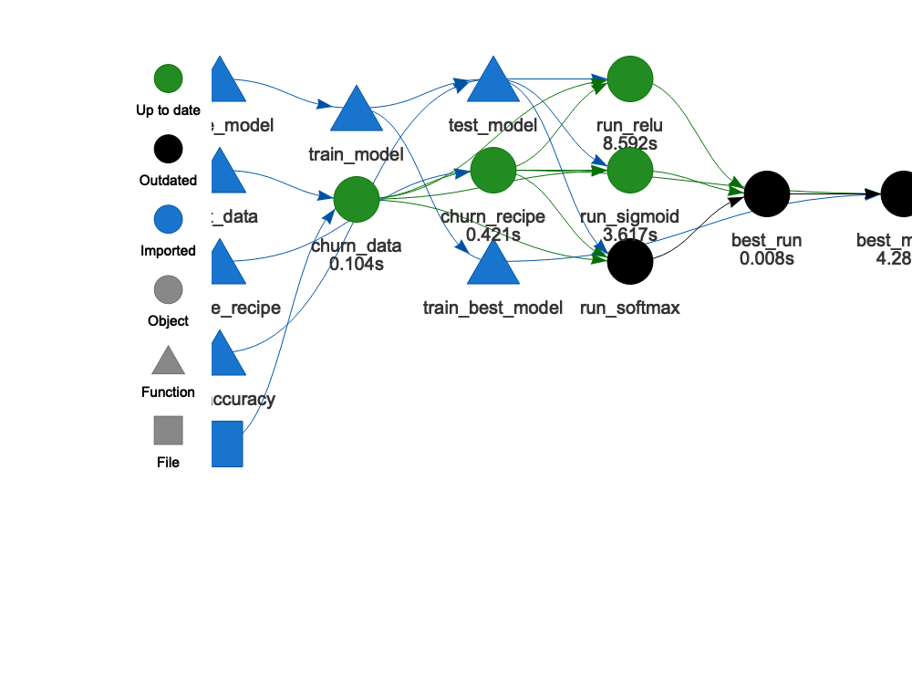
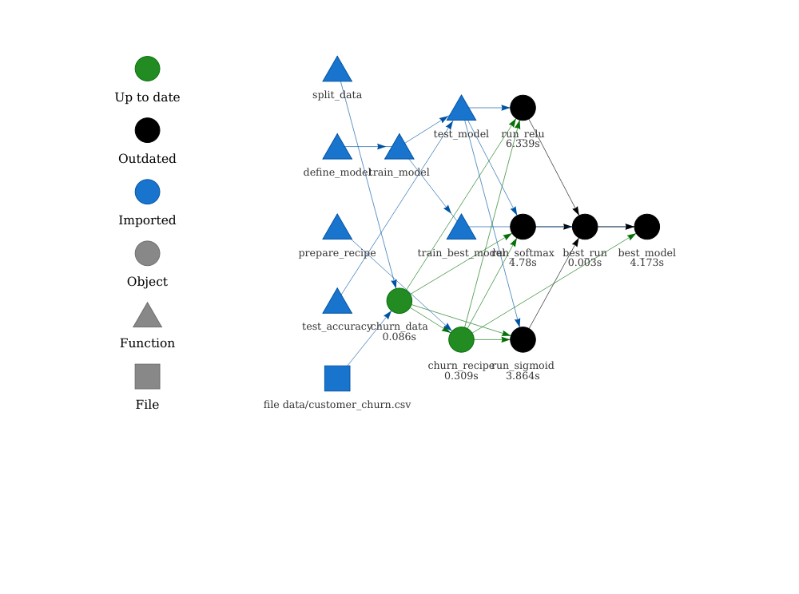
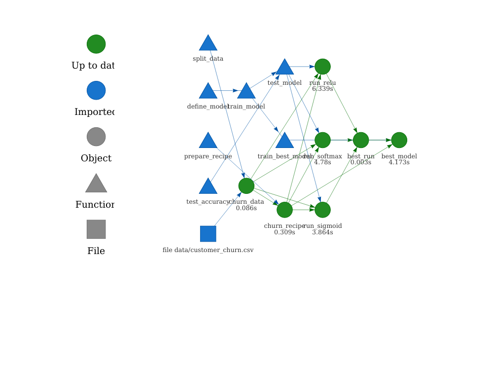

<style>
.inverse {
background-color: transparent;
text-shadow: 0 0 0px transparent;
}
.title-slide {
vertical-align: bottom !important; 
text-align: center !important;
}
.title-slide h1 {
position: absolute;
top: 0;
left: 0;
right: 0;
width: 100%;
line-height: 4em;
color: #666666;
}
.title-slide h3 {
line-height: 6em;
color: #666666;
}
.title-slide {
background-color: white;
background-image: url('images/logo.png');
background-repeat: no-repeat;
background-size: 25%;
}
.remark-slide-content:after {
content: "Copyright Eli Lilly and Company";
position: absolute;
bottom: -5px;
left: 10px;
height: 40px;
width: 100%;
font-family: Helvetica, Arial, sans-serif;
font-size: 0.7em;
color: gray;
background-repeat: no-repeat;
background-size: contain;
}
</style>

```{r, include = FALSE}
knitr::opts_chunk$set(
  collapse = TRUE,
  warning = FALSE,
  comment = "#>",
  fig.align = "center",
  fig.width = 10,
  fig.height = 7,
  out.width = "80%",
  out.height = "80%"
)
```

```{r, include = FALSE, message = FALSE}
options(
  warnPartialMatchArgs = FALSE,
  drake_clean_menu = FALSE,
  drake_make_menu = FALSE,
  htmltools.dir.version = FALSE
)
packages <- c(
  "drake",
  "learndrake",
  "keras",
  "recipes",
  "rsample",
  "tidyverse",
  "yardstick"
)
purrr::walk(
  packages,
  function(pkg) {
    suppressMessages(suppressWarnings(library(pkg, character.only = TRUE)))
  }
)
drake:::r_make_message(force = TRUE)
clean(destroy = TRUE)
```

## Large statistical computation

* [Bayesian data analysis](https://mc-stan.org/)
* [Bayesian network meta-analysis](https://bookdown.org/MathiasHarrer/Doing_Meta_Analysis_in_R/bayesian-network-meta-analysis.html)
* [Graph-based multiple comparison procedures](https://github.com/kornl/gMCP)
* [Subgroup identification](https://cran.r-project.org/web/packages/TSDT/index.html)
* [Predictive modeling](http://appliedpredictivemodeling.com/computing)
* [Deep neural networks](https://keras.rstudio.com/)
* [PK/PD modeling](https://github.com/nlmixrdevelopment/nlmixr)
* Clinical trial simulation
* Target identification

---

## Common features

1. Heavy use of the [R language](https://www.r-project.org/).
2. Long runtimes.
3. Multiple sub-tasks.
4. Frequent changes to code and data.


<br>

* <https://openclipart.org/detail/275842/sisyphus-overcoming-silhouette>

---

## Interconnected tasks
<center>

</center>

---

## Changes

<center>

</center>

---

## Consequences

<center>

</center>

---

## Pipeline tools and workflow managers

<center>

</center>

- Tons exist already: [github.com/pditommaso/awesome-pipeline](https://github.com/pditommaso/awesome-pipeline).
- Most are language-agnostic or designed for Python or the shell.

---

## What distinguishes `drake`?

<center>

</center>

1. Respects the way R works.
2. Pushes you to write better code.

---

## Example drake workflow

- Find the model that best predicts which customers will cancel their telecom subscriptions.
- [IBM Watson Telco Customer Churn dataset](https://www.ibm.com/communities/analytics/watson-analytics-blog/predictive-insights-in-the-telco-customer-churn-data-set/).
- Workflow principles generalize to the life sciences.


<div style="font-size: 0.5em;"><a href="https://openclipart.org/detail/90739/newplus">https://openclipart.org/detail/90739/newplus</a>, <a href="https://github.com/rstudio/keras">https://github.com/rstudio/keras</a></div>

???

To dive into drake, we're going to use a machine learning example. We've got a deep neural net, and we're going to use it to predict "customer churn", which is another way of saying attrition, or dropout.

---

background-image: ./images/not.png

##  Say goodbye to numbered imperative scripts!

```{r, eval = FALSE}
run_everything.R
R/
├── 01-data.R
├── 02-munge.R
├── 03-model.R
├── 04-results.R
└── 05-plot.R
data/
└── customer_churn.csv
```

---

##  drake wants you to write **functions**.

>    - Everything that exists is an object.
>    - Everything that happens is a function call.
>
> John Chambers

```{r}
add_things <- function(argument1, argument2) {
  argument1 + argument2
}

add_things(1, 2)

add_things(c(3, 4), c(5, 6))
```

---

## Functions in a drake workflow

```{r, eval = FALSE}
prepare_recipe <- function(churn_data) {
  churn_data %>%
    training() %>%
    recipe(Churn ~ .) %>%
    step_rm(customerID) %>%
    step_naomit(all_outcomes(), all_predictors()) %>%
    step_discretize(tenure, options = list(cuts = 6)) %>%
    step_log(TotalCharges) %>%
    step_mutate(Churn = ifelse(Churn == "Yes", 1, 0)) %>%
    step_dummy(all_nominal(), -all_outcomes()) %>%
    step_center(all_predictors(), -all_outcomes()) %>%
    step_scale(all_predictors(), -all_outcomes()) %>%
    prep()
}
```

---

## Functions in a drake workflow

```{r, eval = FALSE}
define_model <- function(churn_recipe, units1, units2, act1, act2, act3) {
  # ...
}

train_model <- function(churn_recipe, units1, units2, act1, act2, act3) {
  # ...
}

test_accuracy <- function(churn_data, churn_recipe, model) {
  # ...
}

test_model <- function(churn_data, churn_recipe, units1, units2, act1, act2, act3) {
  # ...
}

best_model <- function(runs, churn_recipe) {
  # ...
}
```

---

## Typical project structure

* There are *many* variations on this theme.

```{r, eval = FALSE}
make.R # Top-level script
R/
├── packages.R # Calls to library(drake), library(keras), etc.
├── functions.R #<<
└── plan.R
data/
└── customer_churn.csv
.drake/ # drake's cache
└──     # Output automatically appears here.
```

```{r, echo = FALSE, message = FALSE, warning = FALSE}
library(drake)
library(keras)
library(tidyverse)
library(rsample)
library(recipes)
library(yardstick)

prepare_recipe <- function(churn_data) {
  churn_data %>%
    training() %>%
    recipe(Churn ~ .) %>%
    step_rm(customerID) %>%
    step_naomit(all_outcomes(), all_predictors()) %>%
    step_discretize(tenure, options = list(cuts = 6)) %>%
    step_log(TotalCharges) %>%
    step_mutate(Churn = ifelse(Churn == "Yes", 1, 0)) %>%
    step_dummy(all_nominal(), -all_outcomes()) %>%
    step_center(all_predictors(), -all_outcomes()) %>%
    step_scale(all_predictors(), -all_outcomes()) %>%
    prep()
}

define_model <- function(churn_recipe, units1, units2, act1, act2, act3) {
  input_shape <- ncol(
    juice(churn_recipe, all_predictors(), composition = "matrix")
  )
  keras_model_sequential() %>%
    layer_dense(
      units = units1,
      kernel_initializer = "uniform",
      activation = act1,
      input_shape = input_shape
    ) %>%
    layer_dropout(rate = 0.1) %>%
    layer_dense(
      units = units2,
      kernel_initializer = "uniform",
      activation = act2
    ) %>%
    layer_dropout(rate = 0.1) %>%
    layer_dense(
      units = 1,
      kernel_initializer = "uniform",
      activation = act3
    )
}

train_model <- function(
  churn_recipe,
  units1 = 16,
  units2 = 16,
  act1 = "relu",
  act2 = "relu",
  act3 = "sigmoid"
) {
  model <- define_model(churn_recipe, units1, units2, act1, act2, act3)
  compile(
    model,
    optimizer = "adam",
    loss = "binary_crossentropy",
    metrics = c("accuracy")
  )
  x_train_tbl <- juice(
    churn_recipe,
    all_predictors(),
    composition = "matrix"
  )
  y_train_vec <- juice(churn_recipe, all_outcomes()) %>%
    pull()
  fit(
    object = model,
    x = x_train_tbl,
    y = y_train_vec,
    batch_size = 32,
    epochs = 32,
    validation_split = 0.3,
    verbose = 0
  )
  model
}

test_accuracy <- function(churn_data, churn_recipe, model) {
  testing_data <- bake(churn_recipe, testing(churn_data))
  x_test_tbl <- testing_data %>%
    select(-Churn) %>%
    as.matrix()
  y_test_vec <- testing_data %>%
    select(Churn) %>%
    pull()
  yhat_keras_class_vec <- model %>%
    predict_classes(x_test_tbl) %>%
    as.factor() %>%
    fct_recode(yes = "1", no = "0")
  yhat_keras_prob_vec <-
    model %>%
    predict_proba(x_test_tbl) %>%
    as.vector()
  test_truth <- y_test_vec %>%
    as.factor() %>%
    fct_recode(yes = "1", no = "0")
  estimates_keras_tbl <- tibble(
    truth = test_truth,
    estimate = yhat_keras_class_vec,
    class_prob = yhat_keras_prob_vec
  )
  estimates_keras_tbl %>%
    conf_mat(truth, estimate) %>%
    summary() %>%
    filter(.metric == "accuracy") %>%
    pull(.estimate)
}

test_model <- function(
  churn_data,
  churn_recipe,
  units1 = 16,
  units2 = 16,
  act1 = "relu",
  act2 = "relu",
  act3 = "sigmoid"
) {
  model <- train_model(churn_recipe, units1, units2, act1, act2, act3)
  accuracy <- test_accuracy(churn_data, churn_recipe, model)
  tibble(
    accuracy = accuracy,
    units1 = units1,
    units2 = units2,
    act1 = act1,
    act2 = act2,
    act3 = act3
  )
}

best_model <- function(runs, churn_recipe) {
  best <- runs %>%
    arrange(desc(accuracy)) %>%
    head(n = 1)
  train_model(
    churn_recipe,
    best$units1,
    best$units2,
    best$act1,
    best$act2,
    best$act3
  )
}
```

---

## Build up your workflow in a **drake plan**.

* Usually goes in the `R/plan.R` script.

```{r}
# R/plan.R
plan <- drake_plan(
  churn_recipe = prepare_recipe(churn_data), # Use your functions. #<<
  churn_data = read_csv(
    file_in("data/customer_churn.csv"),
    col_types = cols()
  ) %>%
    initial_split(prop = 0.3)
)
```

---

## The plan is a data frame of skippable *targets*.

```{r}
plan
```

---

## drake understands code and data dependencies.

```{r, eval = FALSE}
source("R/packages.R")
source("R/functions.R")
source("R/plan.R")
```

```{r, eval = FALSE}
vis_drake_graph(plan)
```

```{r, echo = FALSE}
vis_drake_graph(plan, main = "", file = "images/graph1.png", navigationButtons = FALSE)
```

<center>

</center>


---

## Build your first targets.

```{r, eval = FALSE}
source("R/packages.R")
source("R/functions.R")
source("R/plan.R")
```

```{r}
make(plan)
```

---

## Exploratory analysis

* Load targets from the cache.
* Make sure they came out as expected.

```{r}
ncol(training(readd(churn_data)))

loadd(churn_recipe)
ncol(juice(churn_recipe))
```

---

## Keep building up the plan.

* Continue on and fit some models.

```{r}
# R/plan.R
plan <- drake_plan(
  churn_recipe = prepare_recipe(churn_data), 
  churn_data = read_csv(
    file_in("data/customer_churn.csv"),
    col_types = cols()
  ) %>%
    initial_split(prop = 0.3),
  run_relu = test_model(act1 = "relu", churn_data, churn_recipe), #<<
  run_sigmoid = test_model(act1 = "sigmoid", churn_data, churn_recipe) #<<
)
```

---

## Previous work is still up to date.

```{r, eval = FALSE}
source("R/packages.R")
source("R/functions.R")
source("R/plan.R")
```

```{r, message = FALSE}
outdated(plan)
```

---

## Previous work is still up to date.

```{r, eval = FALSE}
vis_drake_graph(plan)
```

```{r, echo = FALSE}
vis_drake_graph(plan, main = "", file = "images/graph2.png", navigationButtons = FALSE)
```

<center>

</center>

---

## drake skips up-to-date targets.

* The dataset and recipe are up to date, so `drake` skips them and focuses on the models.

```{r, eval = FALSE}
source("R/packages.R")
source("R/functions.R")
source("R/plan.R")
```

```{r}
make(plan)
```

---

## Inspect the newest targets.

```{r}
readd(run_relu)

readd(run_sigmoid)
```

---

## Find the best model

```{r}
plan <- drake_plan(
  churn_recipe = prepare_recipe(churn_data), 
  churn_data = read_csv(
    file_in("data/customer_churn.csv"),
    col_types = cols()
  ) %>%
    initial_split(prop = 0.3),
  run_relu = test_model(act1 = "relu", churn_data, churn_recipe),
  run_sigmoid = test_model(act1 = "sigmoid", churn_data, churn_recipe),
  runs = bind_rows(run_relu, run_sigmoid), #<<
  model = target( #<<
    best_model(runs, churn_recipe), #<<
    format = "keras" #<<
  ) #<<
)
```

---

## Find the best model

```{r}
make(plan)
```

---

## Find the best model

```{r}
readd(model)
```

---

## Try another model.

```{r}
# R/plan.R
plan <- drake_plan(
  churn_recipe = prepare_recipe(churn_data), 
  churn_data = read_csv(
    file_in("data/customer_churn.csv"),
    col_types = cols()
  ) %>%
    initial_split(prop = 0.3),
  run_relu = test_model(act1 = "relu", churn_data, churn_recipe),
  run_sigmoid = test_model(act1 = "sigmoid", churn_data, churn_recipe),
  run_softmax = test_model(act1 = "softmax", churn_data, churn_recipe), #<<
  runs = bind_rows(run_relu, run_sigmoid, run_softmax), #<<
  model = target(
    best_model(runs, churn_recipe),
    format = "keras"
  )
)
```

---

## What gets done stays done.

```{r, eval = FALSE}
source("R/packages.R")
source("R/functions.R")
source("R/plan.R")
```

```{r, message = FALSE}
outdated(plan)
```

---

## What gets done stays done.

```{r, eval = FALSE}
vis_drake_graph(plan)
```

```{r, echo = FALSE}
vis_drake_graph(plan, main = "", file = "images/graph3.png", navigationButtons = FALSE)
```

<center>

</center>

---

## What gets done stays done.

```{r, eval = FALSE}
source("R/packages.R")
source("R/functions.R")
source("R/plan.R")
```

```{r, message = FALSE}
make(plan)
```

---

## New best model?

```{r}
readd(model)
```

---

## What if we need to change a function?

```{r}
define_model <- function(churn_recipe, units1, units2, act1, act2, act3) {
  input_shape <- ncol(
    juice(churn_recipe, all_predictors(), composition = "matrix")
  )
  keras_model_sequential() %>%
    layer_dense(
      units = units1,
      kernel_initializer = "uniform",
      activation = act1,
      input_shape = input_shape
    ) %>%
    layer_dropout(rate = 0.2) %>% # previously 0.1 #<<
    layer_dense(
      units = units2,
      kernel_initializer = "uniform",
      activation = act2
    ) %>%
    layer_dropout(rate = 0.1) %>%
    layer_dense(
      units = 1,
      kernel_initializer = "uniform",
      activation = act3
    )
}
```

---

## drake knows what to do.

```{r, eval = FALSE}
source("R/functions.R")
vis_drake_graph(plan)
```

```{r, echo = FALSE}
vis_drake_graph(plan, main = "", file = "images/graph4.png", navigationButtons = FALSE)
```

<center>

</center>

---

## drake knows what to do.

```{r, eval = FALSE}
source("R/packages.R")
source("R/functions.R")
source("R/plan.R")
```

```{r}
make(plan)
```

---

## Similar story if the data file changes.

```{r, eval = FALSE}
source("R/packages.R")
source("R/functions.R")
source("R/plan.R")
```

```{r, eval = FALSE}
make(plan)
#> target churn_data
#> target churn_recipe
#> target run_relu
#> target run_sigmoid
#> target run_softmax
#> target runs
#> target model
```

---

## Evidence of reproducibility

```{r, eval = FALSE}
source("R/packages.R")
source("R/functions.R")
source("R/plan.R")
```

```{r}
make(plan)

outdated(plan)
```

---

## Evidence of reproducibility

```{r, eval = FALSE}
vis_drake_graph(plan)
```

```{r, echo = FALSE}
vis_drake_graph(plan, main = "", file = "images/graph5.png", navigationButtons = FALSE)
```

<center>

</center>

---

## History of past model runs

```{r}
history <- drake_history() %>%
  select(target, act1, exists, hash) %>%
  filter(!is.na(act1)) %>%
  print()
```

---

## Recover an old model run.

```{r}
drake_cache()$get_value(history$hash[1])
```

---

## More highlights

* [Efficient data formats](https://books.ropensci.org/drake/plans.html#special-data-formats-for-targets)
* [History and data recovery](https://books.ropensci.org/drake/walkthrough.html#history-and-provenance)
* [Dynamic branching](https://books.ropensci.org/drake/dynamic.html)
* [High-performance computing](https://books.ropensci.org/drake/hpc.html)
* [Memory management options](https://books.ropensci.org/drake/memory.html)

---

## Resources

* Get [`drake`](https://github.com/ropensci/drake):

```{r, eval = FALSE}
install.packages("drake")
```

* Example code from these slides:

```{r, eval = FALSE}
drake::drake_example("customer-churn")
```

* Workshop materials:

```{r, eval = FALSE}
remotes::install_github("wlandau/learndrake")
```

---

## Links

- Development repository: <https://github.com/ropensci/drake>
- Full user manual <https://books.ropensci.org/drake/>
- Reference website: <https://docs.ropensci.org/drake>
- Hands-on workshop: <https://github.com/wlandau/learndrake>
- Code examples: <https://github.com/wlandau/drake-examples>
- Discuss at rOpenSci.org: <https://discuss.ropensci.org>

## rOpenSci use cases

- Use [`drake`](https://github.com/ropensci/drake)? Share your use case at <https://ropensci.org/usecases>.

<center>

</center>

---

## Thanks

<br>
<br>
<table style = "border: none">
<tr>
<td style = "padding-right: 125px">
<ul style>

<li><a href = "https://github.com/edgararuiz">Edgar Ruiz</a></li>
<li><a href = "https://github.com/sol-eng/tensorflow-w-r/blob/master/workflow/tensorflow-drake.Rmd">example code</a></li>
</ul>
</td>
<td>
<ul>

<li><a href = "https://github.com/mdancho84">Matt Dancho</a></li>
<li><a href = "https://blogs.rstudio.com/tensorflow/posts/2018-01-11-keras-customer-churn/">blog post</a></li>
</ul>
</td>
</tr>
</table>

---

## Thanks

<table style = "border: none">
<tr>
<td>
<br>
<ul>

<li><a href = "https://github.com/maelle">Maëlle Salmon</a></li>
<li><a href = "https://github.com/benmarwick">Ben Marwick</a></li>
<li><a href = "https://github.com/jules32">Julia Lowndes</a></li>
<li><a href = "https://github.com/gothub">Peter Slaughter</a></li>
<li><a href = "https://github.com/jennybc">Jenny Bryan</a></li>
<li><a href = "https://github.com/richfitz">Rich FitzJohn</a></li>
<li><a href = "https://github.com/stefaniebutland">Stefanie Butland</a></li>
</ul>
</td>
<td>
<ul>
<li><a href = "https://github.com/jarad">Jarad Niemi</a></li>
<li><a href = "https://github.com/krlmlr">Kirill Müller</a></li>
<li><a href = "https://github.com/HenrikBengtsson">Henrik Bengtsson</a></li>
<li><a href = "https://github.com/mschubert">Michael Schubert</a></li>
<li><a href = "https://github.com/kendonB">Kendon Bell</a></li>
<li><a href = "https://github.com/milesmcbain">Miles McBain</a></li>
<li><a href = "https://github.com/pat-s">Patrick Schratz</a></li>
<li><a href = "https://github.com/AlexAxthelm">Alex Axthelm</a></li>
<li><a href = "https://github.com/dapperjapper">Jasper Clarkberg</a></li>
<li><a href = "https://github.com/tiernanmartin">Tiernan Martin</a></li>
<li><a href = "https://github.com/BListyg">Ben Listyg</a></li>
<li><a href = "https://github.com/tjmahr">TJ Mahr</a></li>
<li><a href = "https://github.com/bpbond">Ben Bond-Lamberty</a></li>
<li><a href = "https://github.com/tmastny">Tim Mastny</a></li>
<li><a href = "https://github.com/billdenney">Bill Denney</a></li>
<li><a href = "https://github.com/aedobbyn">Amanda Dobbyn</a></li>
<li><a href = "https://github.com/dfalster">Daniel Falster</a></li>
<li><a href = "https://github.com/rkrug">Rainer Krug</a></li>
<li><a href = "https://github.com/bmchorse">Brianna McHorse</a></li>
<li><a href = "https://github.com/mrchypark">Chan-Yub Park</a></li>
</ul>
</td>
</tr>
</table>

```{r, include = FALSE}
clean(destroy = TRUE)
```
