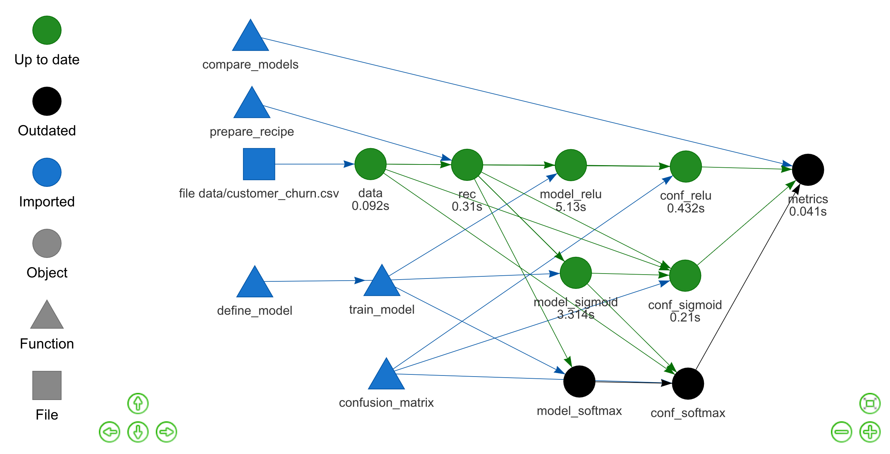
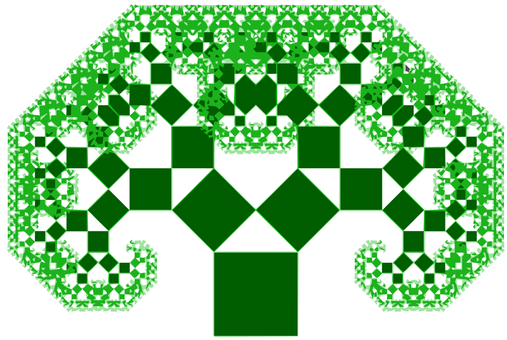

<style>
.inverse {
background-color: transparent;
text-shadow: 0 0 0px transparent;
}
.title-slide {
vertical-align: bottom !important; 
text-align: center !important;
}
.title-slide h1 {
position: absolute;
top: 0;
left: 0;
right: 0;
width: 100%;
line-height: 4em;
color: #666666;
}
.title-slide h3 {
line-height: 6em;
color: #666666;
}
.title-slide {
background-color: white;
background-image: url('images/logo.png');
background-repeat: no-repeat;
background-size: 25%;
}
.remark-slide-content:after {
content: "Copyright Eli Lilly and Company";
position: absolute;
bottom: -5px;
left: 20px;
height: 40px;
width: 100%;
font-family: Helvetica, Arial, sans-serif;
color: gray;
background-repeat: no-repeat;
background-size: contain;
}
</style>

```{r c1, include = FALSE}
options(
  warnPartialMatchArgs = FALSE,
  drake_clean_menu = FALSE,
  drake_make_menu = FALSE,
  htmltools.dir.version = FALSE
)
packages <- c(
  "drake",
  "keras",
  "recipes",
  "rsample",
  "tidyverse",
  "yardstick"
)
unlink(".RData")
purrr::walk(
  packages,
  function(pkg) {
    suppressMessages(suppressWarnings(library(pkg, character.only = TRUE)))
  }
)
clean(destroy = TRUE, verbose = FALSE)
unlink(".drake_history", recursive = TRUE, force = TRUE)
knitr::opts_chunk$set(
  collapse = TRUE,
  warning = FALSE,
  fig.align = "center",
  fig.width = 10,
  fig.height = 7,
  out.width = "80%",
  out.height = "80%"
)
```

## Large data science workflows

- Struggles

  1. Long runtimes.
  2. Many tasks.
  3. Interconnected tasks.

- Examples
  - Deep learning.
  - Classical machine learning.
  - Bayesian data analysis via Markov chain Monte Carlo.
  - Spatial data analysis.
  - Clinical trial modeling and simulation.
  - Subgroup identification.
  - Graph-based multiple comparison procedures.
  - Genomics pipelines.
  - PK/PD modeling.

---

## Interconnected tasks
<center>

</center>

---

## When you change something...
<center>

</center>

---

## ...the downstream output is **no longer valid**.

<center>

</center>

---

## Do you rerun **everything** from scratch?

- Not if you deal with long runtimes!

<center>

<div style="font-size: 0.5em; text-align: center"><a href="https://openclipart.org/detail/275842/sisyphus-overcoming-silhouette">https://openclipart.org/detail/275842/sisyphus-overcoming-silhouette</a></div>
</center>

---

## Do you pick and choose what to update?

- Messy.
- Prone to human error.
- Not reproducible.

<center>

<div style="font-size: 0.5em; text-align: center;"><a href="https://openclipart.org/detail/216179/messy-desk">https://openclipart.org/detail/216179/messy-desk</a></div>
</center>

---

## Solution: pipeline tools

<center>

</center>

- Tons exist already: [github.com/pditommaso/awesome-pipeline](https://github.com/pditommaso/awesome-pipeline).
- Most are language-agnostic or designed for Python or the shell.

---

## What distinguishes `drake`?

<center>

</center>

- Aggressively designed for R.
1. Think **functions**, not script files.
2. Think **variables**, not output files.
3. Think **data frames**, not `Makefile`s.
- [`drake`](https://github.com/ropensci/drake) borrows (1) and (2) from the [`remake`](https://github.com/richfitz/remake) package by [Rich FitzJohn](https://github.com/richfitz).
- [`remake`](https://github.com/richfitz/remake) is no longer under development.
- [`drake`](https://github.com/ropensci/drake) tries to extend [`remake`](https://github.com/richfitz/remake)'s ideas further and handle larger projects.

---

## Example: a deep learning workflow

- Goal: predict customers who cancel their subscriptions with a telecom company.
- Data: [IBM Watson Telco Customer Churn dataset](https://www.ibm.com/communities/analytics/watson-analytics-blog/predictive-insights-in-the-telco-customer-churn-data-set/).
- Workflow principles generalize to other industries.


<div style="font-size: 0.5em;"><a href="https://openclipart.org/detail/90739/newplus">https://openclipart.org/detail/90739/newplus</a>, <a href="https://github.com/rstudio/keras">https://github.com/rstudio/keras</a></div>

---

background-image: ./images/not.png

##  Let's move beyond numbered scripts.

```{r files_bad, eval = FALSE}
run_everything.R
R/
├── 01-data.R
├── 02-munge.R
├── 03-model.R
├── 04-results.R
└── 05-plot.R
data/
└── customer_churn.csv
output/
├── model_relu.h5
├── model_sigmoid.h5
├── confusion_matrix.rds
└── metrics_plot.png
```

---

##  Why not numbered scripts?

- The planning and the execution happen at the same time.
- Too cumbersome, ad hoc, and tangled for ambitious projects.

```{r c2, eval = FALSE}
# 02-munge.R
library(recipes) # Package dependencies scattered across scripts. #<<

rec <- data %>% # Single-use code, difficult to test. #<<
  training() %>%
  recipe(Churn ~ .) %>%
  step_rm(customerID) %>%
  step_naomit(all_outcomes(), all_predictors()) %>%
  step_discretize(tenure, options = list(cuts = 6)) %>%
  step_log(TotalCharges) %>%
  step_mutate(Churn = ifelse(Churn == "Yes", 1, 0)) %>%
  step_dummy(all_nominal(), -all_outcomes()) %>%
  step_center(all_predictors(), -all_outcomes()) %>%
  step_scale(all_predictors(), -all_outcomes()) %>%
  prep()

saveRDS(rec, "recipe.rds") # Final output scattered across code. #<<
```

---

##  Instead, embrace **functions**!

- A function is a reusable command that accepts one or more inputs and returns a single output.

```{r def}
my_function <- function(argument1, argument2) {
  argument1 + argument2
}

my_function(1, 2)

my_function(3, 4)
```

---

## Why use functions?

1. Clarity: break down complicated ideas into manageable pieces.
2. Use R as intended.

    >    - Everything that exists is an object.
    >    - Everything that happens is a function call.
    >
    > John Chambers

3. Reuse: define once, run wherever.


---

## Functions in a workflow

```{r files_good, eval = FALSE}
make.R
R/
├── packages.R
├── functions.R #<<
└── plan.R
data/
└── customer_churn.csv
.drake/ # drake's cache
└──     # Output automatically appears here.
```

---

## Functions in a workflow

```{r c3.0, eval = FALSE}
# packages.R: all package dependencies #<<
library(recipes)
# other packages...
````

```{r c3, eval = FALSE}
# functions.R: pure reusable code #<<
prepare_recipe <- function(data) {
  data %>%
    training() %>%
    recipe(Churn ~ .) %>%
    step_rm(customerID) %>%
    step_naomit(all_outcomes(), all_predictors()) %>%
    step_discretize(tenure, options = list(cuts = 6)) %>%
    step_log(TotalCharges) %>%
    step_mutate(Churn = ifelse(Churn == "Yes", 1, 0)) %>%
    step_dummy(all_nominal(), -all_outcomes()) %>%
    step_center(all_predictors(), -all_outcomes()) %>%
    step_scale(all_predictors(), -all_outcomes()) %>%
    prep()
}
# other functions...
```

---

## Functions in a workflow

```{r run_everything}
# later in functions.R...

run_everything <- function() {
  data <- read_csv(file_in("data/customer_churn.csv"), col_types = cols()) %>%
    initial_split(prop = 0.3)
  saveRDS(data, "output/data.rds")

  rec <- prepare_recipe(data) # Call your other functions. #<<
  saveRDS(rec, "output/rec.rds")

  model_relu <- train_model(rec, act1 = "relu")
  save_model_hdf5(model_relu, "output/model_relu.h5")
  # more models...

  conf_sigmoid <- confusion_matrix(data, rec, model_sigmoid)
  saveRDS(conf_sigmoid, "output/conf_sigmoid.rds")
  # more confusion matrices...

  metrics <- compare_models(conf_relu, conf_sigmoid)
  saveRDS(metrics, "output/metrics.rds")
}
```

---

## Conduct your analysis with your **functions**.

```{r c3.5, eval = FALSE}
# run_everything.R
source("R/packages.R")
source("R/functions.R")
run_everything()
```

---

## But we can still do better...

- Avoid rerunning every function on every runthrough.
- Avoid micromanaging output files.

<center>

<div style="font-size: 0.5em; text-align: center"><a href="https://publicdomainvectors.org/en/free-clipart/Golden-magic-lamp/61683.html">https://publicdomainvectors.org/en/free-clipart/Golden-magic-lamp/61683.html</a></div>
</center>

---

## Enter drake! Define a **plan**.

```{r c4}
plan <- drake_plan(
  rec = prepare_recipe(data), # Use your functions. #<<
  model = target(
    train_model(rec, act1 = act),
    format = "keras",
    transform = map(act = c("relu", "sigmoid"))
  ),
  conf = target(
    confusion_matrix(data, rec, model),
    transform = map(model, .id = act)
  ),
  metrics = target(
    compare_models(conf),
    transform = combine(conf)
  ),
  data = read_csv(                      # flexible target order, #<<
    file_in("data/customer_churn.csv"), # flexible commands #<<
    col_types = cols()
  ) %>%
    initial_split(prop = 0.3)
)
```

---

## The plan is a data frame of skippable tasks.

```{r c5}
plan
```

---

## The workflow

<br>
<center>

</center>

---

## Run the project in make.R.

```{r c6}
# like run_everything.R...
source("R/packages.R")
source("R/functions.R")
source("R/plan.R")

make(plan)
```

---

## Compare models.

```{r c7}
readd(metrics) # See also loadd()
```

---

## Add a new model.

```{r c8}
plan <- drake_plan(
  rec = prepare_recipe(data),
  model = target(
    train_model(rec, act1 = act),
    format = "keras",
    transform = map(act = c("relu", "sigmoid", "softmax")) #<<
  ),
  conf = target(
    confusion_matrix(data, rec, model),
    transform = map(model, .id = act)
  ),
  metrics = target(
    compare_models(conf),
    transform = combine(conf)
  ),
  data = read_csv(
    file_in("data/customer_churn.csv"),
    col_types = cols()
  ) %>%
    initial_split(prop = 0.3)
)
```

```{r c8write, echo = FALSE}
tmp <- file.copy("R/plan.R", "R/tmp.R", overwrite = TRUE)
tmp <- file.copy("R/plan2.R", "R/plan.R", overwrite = TRUE)
```

---

## vis_drake_graph()

<center>

</center>

---

## Refresh the results in make.R.

```{r c9}
source("R/packages.R")
source("R/functions.R")
source("R/plan.R") # modified #<<

make(plan)
```

---

## Compare models.

```{r c7updated}
readd(metrics)
```

---

## Evidence of reproducibility

```{r c10}
source("R/packages.R")
source("R/functions.R")
source("R/plan.R")

make(plan)
```

- See also `outdated()`.

---

## Efficient data formats

- Increased speed and reduced memory consumption.

```{r, eval = FALSE}
library(drake)
n <- 1e8 # Each target is 1.6 GB in memory.
plan <- drake_plan(
  data_fst = target(
    data.frame(x = runif(n), y = runif(n)),
    format = "fst" #<<
  ),
  data_old = data.frame(x = runif(n), y = runif(n))
)
make(plan)
#> target data_fst
#> target data_old
build_times(type = "build")
#> # A tibble: 2 x 4
#>   target   elapsed              user                 system    
#>   <chr>    <Duration>           <Duration>           <Duration>
#> 1 data_fst 13.93s               37.562s              7.954s #<<
#> 2 data_old 184s (~3.07 minutes) 177s (~2.95 minutes) 4.157s #<<
```

---

## History and provenance

```{r history}
drake_history()
```

---

## Reproducible data recovery

```{r recovery}
clean() # Oops!

start <- proc.time()
make(plan, recover = TRUE)

proc.time() - start
```

- Details + how to rename a target: <https://ropenscilabs.github.io/drake-manual/walkthrough.html#reproducible-data-recovery-and-renaming>

---

## Dependency-aware high-performance computing

- Just a little configuration...

```{r c11, eval = FALSE}
# template file with configuration
drake_hpc_template_file("slurm_clustermq.tmpl")

# Use SLURM resource manager with the template.
options(
  clustermq.scheduler = "slurm",
  clustermq.template = "slurm_clustermq.tmpl"
)

# make() is the basically the same.
make(plan, jobs = 2, parallelism = "clustermq")
```

---

## Dependency-aware high-performance computing

<iframe width="800" height="450" src="https://www.powtoon.com/embed/bUfSIaXjrw5/" frameborder="0"></iframe>

---

## Resources

- Get [`drake`](https://github.com/ropensci/drake):

```{r c12, eval = FALSE}
install.packages("drake")
```

- Example code from these slides:

```{r c14, eval = FALSE}
drake::drake_example("customer-churn")
```

- Workshop materials:

```{r c13, eval = FALSE}
remotes::install_github("wlandau/learndrake")
```

---

## Links

- Development repository: <https://github.com/ropensci/drake>
- Full user manual <https://ropenscilabs.github.io/drake-manual>
- Reference website: <https://docs.ropensci.org/drake>
- Hands-on workshop: <https://github.com/wlandau/learndrake>
- Code examples: <https://github.com/wlandau/drake-examples>
- Discuss at rOpenSci.org: <https://discuss.ropensci.org>

## rOpenSci use cases

- Use [`drake`](https://github.com/ropensci/drake)? Share your use case at <https://ropensci.org/usecases>.

<center>

</center>

---

## Thanks

<br>
<br>
<table style = "border: none">
<tr>
<td style = "padding-right: 125px">
<ul style>

<li><a href = "https://github.com/edgararuiz">Edgar Ruiz</a></li>
<li><a href = "https://github.com/sol-eng/tensorflow-w-r/blob/master/workflow/tensorflow-drake.Rmd">example code</a></li>
</ul>
</td>
<td>
<ul>

<li><a href = "https://github.com/mdancho84">Matt Dancho</a></li>
<li><a href = "https://blogs.rstudio.com/tensorflow/posts/2018-01-11-keras-customer-churn/">blog post</a></li>
</ul>
</td>
</tr>
</table>

---

## Thanks

<table style = "border: none">
<tr>
<td>
<br>
<ul>

<li><a href = "https://github.com/maelle">Maëlle Salmon</a></li>
<li><a href = "https://github.com/benmarwick">Ben Marwick</a></li>
<li><a href = "https://github.com/jules32">Julia Lowndes</a></li>
<li><a href = "https://github.com/gothub">Peter Slaughter</a></li>
<li><a href = "https://github.com/jennybc">Jenny Bryan</a></li>
<li><a href = "https://github.com/richfitz">Rich FitzJohn</a></li>
<li><a href = "https://github.com/stefaniebutland">Stefanie Butland</a></li>
</ul>
</td>
<td>
<ul>
<li><a href = "https://github.com/jarad">Jarad Niemi</a></li>
<li><a href = "https://github.com/krlmlr">Kirill Müller</a></li>
<li><a href = "https://github.com/HenrikBengtsson">Henrik Bengtsson</a></li>
<li><a href = "https://github.com/mschubert">Michael Schubert</a></li>
<li><a href = "https://github.com/kendonB">Kendon Bell</a></li>
<li><a href = "https://github.com/milesmcbain">Miles McBain</a></li>
<li><a href = "https://github.com/pat-s">Patrick Schratz</a></li>
<li><a href = "https://github.com/AlexAxthelm">Alex Axthelm</a></li>
<li><a href = "https://github.com/dapperjapper">Jasper Clarkberg</a></li>
<li><a href = "https://github.com/tiernanmartin">Tiernan Martin</a></li>
<li><a href = "https://github.com/BListyg">Ben Listyg</a></li>
<li><a href = "https://github.com/tjmahr">TJ Mahr</a></li>
<li><a href = "https://github.com/bpbond">Ben Bond-Lamberty</a></li>
<li><a href = "https://github.com/tmastny">Tim Mastny</a></li>
<li><a href = "https://github.com/billdenney">Bill Denney</a></li>
<li><a href = "https://github.com/aedobbyn">Amanda Dobbyn</a></li>
<li><a href = "https://github.com/dfalster">Daniel Falster</a></li>
<li><a href = "https://github.com/rkrug">Rainer Krug</a></li>
<li><a href = "https://github.com/bmchorse">Brianna McHorse</a></li>
<li><a href = "https://github.com/mrchypark">Chan-Yub Park</a></li>
</ul>
</td>
</tr>
</table>

---

## A riddle!

- From a math PhD oral exam:

> Give an example of a nontrivial function.

- Hint: the best answers do not even come from math or computing!

<center>

<div style="font-size: 0.5em; text-align: center"><a href="https://publicdomainvectors.org/en/free-clipart/Pythagoras-tree/58775.html">https://publicdomainvectors.org/en/free-clipart/Pythagoras-tree/58775.html</a></div>
</center>

```{r c15, include = FALSE}
tmp <- file.copy("R/plan.R", "R/plan2.R", overwrite = TRUE)
tmp <- file.copy("R/tmp.R", "R/plan.R", overwrite = TRUE)
unlink("R/tmp.R")
clean(destroy = TRUE)
unlink(".drake_history", recursive = TRUE, force = TRUE)
```
